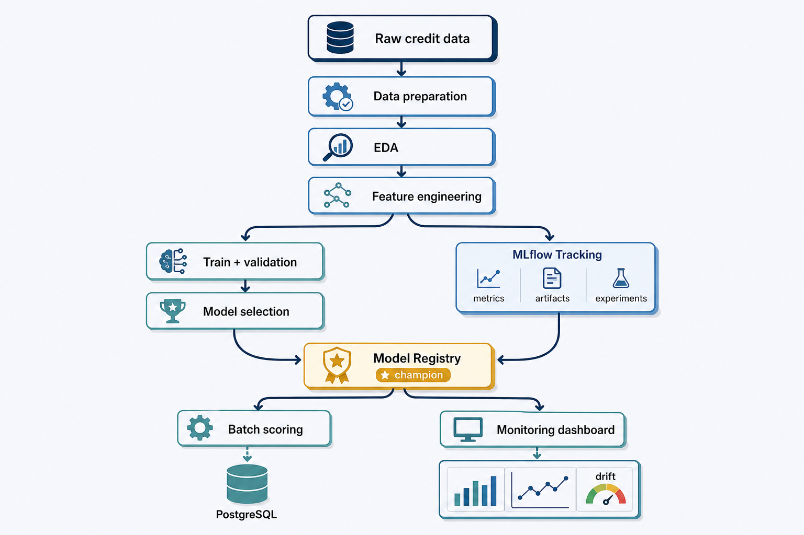

# Credit Risk Modeling

An end-to-end machine learning project that estimates credit-default
probability in a batch-scoring setting. It combines exploratory analysis,
feature engineering, model selection, MLflow tracking and registration, and
reproducible local infrastructure.

The workflow separates training, validation, and final testing, evaluates
financial impact in addition to statistical metrics, and packages the selected
model with a clear prediction contract.



## Key findings

### Exploratory analysis

The exploratory analysis examines data quality, observed risk patterns, and
candidate features before modelling. Its findings are descriptive rather than
causal.

| Exploration | What the analysis found | How it informed modelling |
| --- | --- | --- |
| Portfolio imbalance | The analysis found 307,511 applications, with default representing 8.07% of the portfolio. | Accuracy was not used as a primary measure; PR-AUC, recall, KS, and class weighting received more emphasis. |
| Missingness | The analysis found substantial missingness in housing and external-score variables: `BASEMENTAREA_MEDI` is missing in 58.52% of rows and `EXT_SOURCE_1` in 56.38%. | Missingness indicators were considered alongside imputation. |
| Contract type | The analysis observed an 8.35% default rate for cash loans and 5.48% for revolving loans. | Contract type remained a candidate feature; the association was not interpreted as causal. |
| Gender | The analysis observed default odds roughly 1.50 times higher for male applicants. | This is a fairness-review and monitoring signal, never a standalone decision rule. |
| Financial outliers | The Isolation Forest analysis found a 6.19% default rate among outliers, below the 8.42% rate in the remaining portfolio. | Financial atypicality alone was not treated as a proxy for higher credit risk. |
| Split stability | The analysis confirmed similar default rates across train (8.0729%), validation (8.0728%), and test (8.0728%). | Stratification preserved the event rate across partitions. |

The analysis also engineers domain-oriented financial features, removes
constant variables, prunes highly correlated features, and evaluates
candidates with IV, WoE, univariate KS, chi-square testing, and Cramér's V.

### Modelling and business analysis

The modelling notebook selects LightGBM by cross-validation using PR-AUC as
the primary metric. It retains the manual LightGBM configuration when Optuna
tuning does not generalise better on validation, selects the decision threshold
on validation data, measures lift in the highest-risk decile, and evaluates
captured and missed exposure through `AMT_CREDIT`.

The final test set is reserved for one assessment after model and threshold
decisions are frozen.

## Workflow

```text
Raw credit data
    -> preparation, EDA, and feature engineering
    -> stratified train / validation / test datasets
    -> feature selection and cross-validation
    -> hyperparameter and threshold selection on validation
    -> one-time test evaluation
    -> MLflow artifacts and Model Registry
    -> batch scoring with models:/credit-risk-model@champion
```

## Architecture and design notes

- [Dataset preparation and join logic](docs/data-preparation.md)
- [Batch inference, monitoring, and retraining design](docs/operations-architecture.md)
- [Technical model development report source — Portuguese (Quarto)](docs/documentation/technical-documentation-pt-br.qmd)
- [Technical model development report — Portuguese (HTML)](docs/documentation/technical-documentation-pt-br.html)

The repository includes Airflow DAGs for manual batch inference and controlled
retraining, PostgreSQL migrations for the monitoring schema, and reusable
modules under `src/` for prediction, training, promotion, and monitoring.
Power BI is the intended consumer of the PostgreSQL monitoring schema; the
repository does not include a committed `.pbix` dashboard.

## Repository structure

```text
.
├── data/                   # Raw and interim datasets (not versioned)
├── airflow/                # Batch inference and controlled retraining DAGs
├── database/migrations/    # PostgreSQL monitoring schema and reporting views
├── docker/                 # MLflow server image
├── docs/                   # Architecture, technical reports, and presentation
├── notebooks/              # Data preparation, EDA, and modelling
├── src/                    # Reusable data, feature, model, pipeline, and monitoring code
├── tests/
├── docker-compose.yml
├── pyproject.toml
└── uv.lock
```

## Run locally

### Prerequisites

- Python 3.11. The training and Airflow environments are pinned to the runtime
  recorded for the current MLflow champion, preventing unsafe model loading.
- [uv](https://docs.astral.sh/uv/) for dependency management.
- Docker Desktop with Docker Compose.
- VS Code with the Python and Jupyter extensions.
- Source CSV files under `data/raw/`; see the [data preparation guide](docs/data-preparation.md).

### 1. Configure local credentials

Create a local `.env` file. It is ignored by Git and must not be committed.

```dotenv
POSTGRES_DB=mlflow
POSTGRES_USER=mlflow
POSTGRES_PASSWORD=your-local-url-safe-password
AIRFLOW_FERNET_KEY=your-fernet-key
AIRFLOW_WEBSERVER_SECRET_KEY=your-webserver-secret
AIRFLOW_ADMIN_PASSWORD=your-airflow-admin-password
MONITORING_KEY_SALT=your-long-random-monitoring-salt
```

Use a URL-safe password because Compose inserts it into the PostgreSQL
connection URI. Characters such as `@`, `:`, `/`, and `#` must be
URL-encoded.

### 2. Install dependencies and start services

The commands below use Docker Compose V2. If your Docker Desktop exposes only
the legacy command, replace `docker compose` with `docker-compose`.

```powershell
uv sync --locked --group dev
docker compose up -d --build
```

Open MLflow at [http://localhost:5000](http://localhost:5000).
Open Airflow at [http://localhost:8080](http://localhost:8080) and sign in
with `AIRFLOW_ADMIN_USERNAME` (default: `admin`) and the password configured
in `.env`.

### 3. Run the notebooks

Open the cloned repository folder in VS Code, select the interpreter from
`.venv`, and run:

1. `00_PREP_DATA.ipynb`
2. `01_EDA-FE.ipynb`
3. `02_PROCESSING_TRAING_MODEL.ipynb`

## Batch inference, monitoring, and retraining

The services start together through Docker Compose. The database bootstrap
service creates the monitoring schema before Airflow starts; its migrations are
stored in `database/migrations/`.

- `airflow/batch_inference_dag.py` resolves
  `models:/credit-risk-model@champion`, scores a batch, and persists the
  prediction audit trail for monitoring.
- `airflow/retraining_dag.py` is manually triggered and only proceeds when
  enough mature labels are available. It records the attempt, evaluates a
  challenger against the champion, and moves the alias only when the declared
  promotion gates pass.
- PostgreSQL stores training references, scored batches, drift profiles,
  model performance, and retraining audit records. Power BI can model the
  selected dimension and fact tables from the `monitoring` schema.

These workflows are intentionally manual by default: it is safer for a
portfolio project and makes each retraining decision explicit and auditable.

## MLflow model contract

The registered model is loaded through:

```text
models:/credit-risk-model@champion
```

It accepts the 67 selected raw features and returns:

| Output | Description |
| --- | --- |
| `probability_default` | Estimated probability of default. |
| `default_prediction` | Binary decision using the validation-selected threshold. |

MLflow stores metrics, feature importance, SHAP plots, threshold metadata,
input/output examples, and the model signature with the registered version.

## Useful commands

```powershell
docker compose logs -f mlflow
docker compose logs -f postgres
docker compose logs -f airflow-scheduler
docker compose ps
docker compose down
uv run pytest
uv run ruff check src tests airflow
```

## Notes

- Raw and interim datasets are intentionally excluded from version control.
- Model and threshold selection must not use the final test set.
- Airflow credentials, database passwords, and monitoring salts belong only in
  `.env`; never commit them.
- This is an educational and portfolio project. A production credit decision
  system requires governance, privacy controls, fairness assessment,
  monitoring, and human review.
