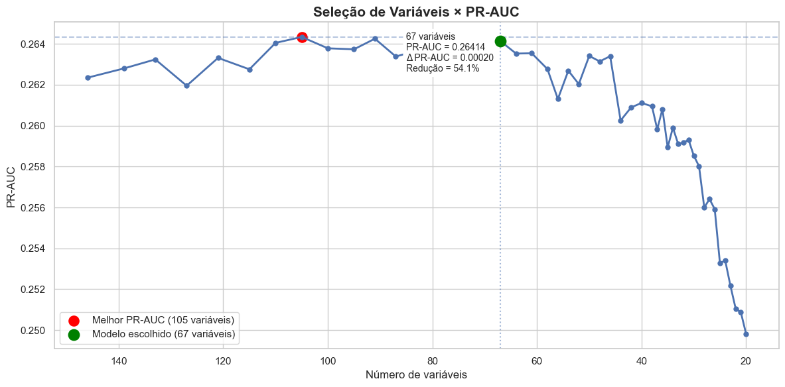
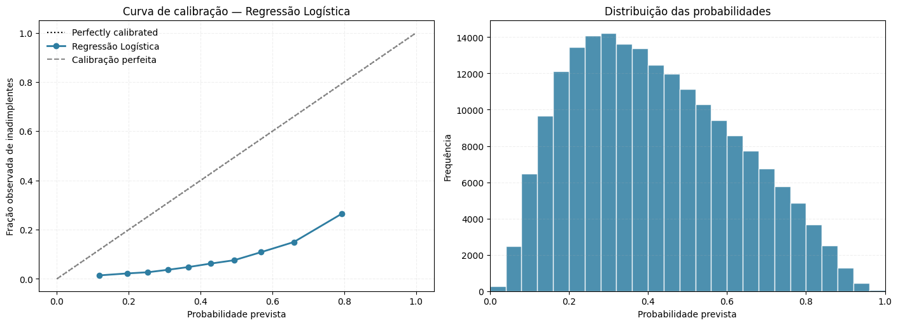
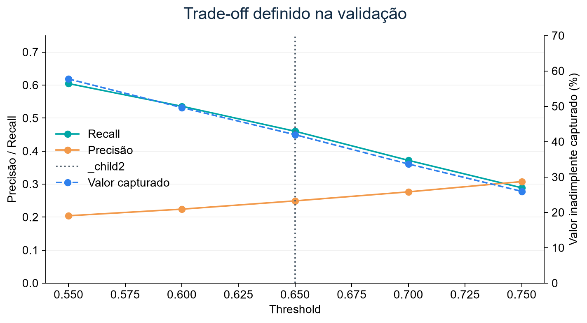
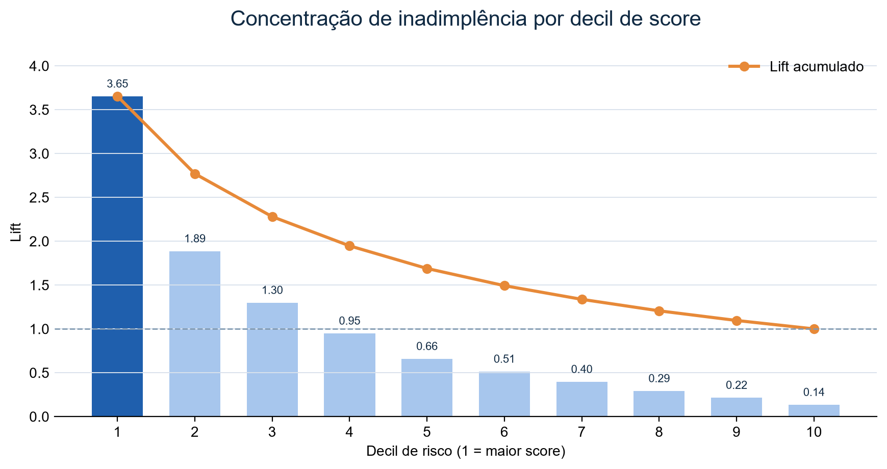
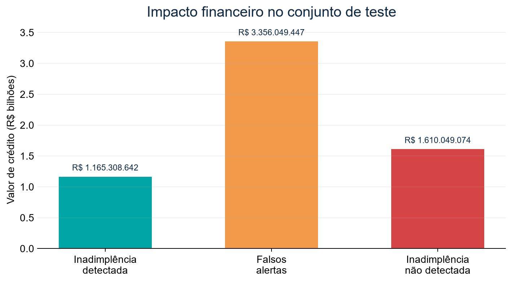

## Executive Technical Summary {.unnumbered}

Este é um *Technical Model Development Report*, não um README. Ele reconstrói o desenvolvimento usando os notebooks 00-03, código `src/`, configurações, DAGs, migrações e resultados preservados. A estrutura é: evidência observada → interpretação técnica → decisão → consequência.

<div class="report-kpis" role="list" aria-label="Indicadores centrais do relatório">
  <div class="report-kpi" role="listitem"><strong>307.511</strong><span>propostas analisadas</span></div>
  <div class="report-kpi" role="listitem"><strong>8,07%</strong><span>taxa de inadimplência</span></div>
  <div class="report-kpi" role="listitem"><strong>67</strong><span>features no contrato final</span></div>
  <div class="report-kpi" role="listitem"><strong>0,2790</strong><span>PR-AUC no conjunto de teste</span></div>
</div>

| Contexto | Evidência | Decisão | Consequência |
|---|---|---|---|
| Classe rara | 307.511 propostas; 8,07% de inadimplência | PR-AUC e pesos de classe são prioritários | Acurácia não seleciona o modelo |
| Complexidade | 146 atributos pré-wrapper | RFECV reteve 67 | Contrato menor de inferência e monitoramento |
| Algoritmo | LightGBM: PR-AUC CV 0,2641 ± 0,0029 | Champion | Melhor ranking entre RF, XGBoost e baseline |
| Operação | Threshold 0,65 definido na validação | Decisão separada do treinamento | 41,99% da exposição inadimplente foi sinalizada no teste |

<div class="decision-strip" aria-label="Síntese de decisão do modelo">
  <div><b>Evidence</b><span>Classe positiva de 8,07% em 307.511 propostas.</span></div>
  <div><b>Decision</b><span>LightGBM promovido pelo ranking PR-AUC em validação cruzada.</span></div>
  <div><b>Result</b><span>PR-AUC de 0,2790 e KS de 0,4168 no teste final.</span></div>
  <div><b>Risk</b><span>Não há validação temporal/out-of-time preservada.</span></div>
  <div><b>Business impact</b><span>41,99% da exposição inadimplente foi sinalizada no teste.</span></div>
</div>

**Estado registrado:** `credit-risk-model`, versão 1, alias `champion`, run `041dcb5dc2bf4c169bff35c527d334a7`. O modelo retorna `probability_default` e `default_prediction`.

::: {.callout-warning}
## Lacunas auditáveis

Não foi identificada validação temporal/out-of-time. O espaço de busca, número de trials e histórico do Optuna não estão preservados nos notebooks versionados. Essas são lacunas de evidência, não informações a serem inferidas.
:::

# Contexto e formulação do problema

## Business Problem

Priorizar propostas de crédito com maior probabilidade de inadimplência. Um falso negativo deixa exposição sem sinalização; um falso positivo consome capacidade analítica e pode gerar atrito. Custos monetários, política de aprovação e horizonte formal do target não foram identificados no material e precisam ser definidos por negócio e risco.

## Analytical Problem → ML Problem → Decision Problem

| Camada | Formulação |
|---|---|
| Analítica | Uma linha por aplicação `SK_ID_CURR`; target binário `TARGET` (`1` inadimplência observada, `0` não inadimplência). |
| Machine learning | Classificação supervisionada que estima $P(TARGET=1\mid X)$. |
| Decisão | Aplicar um threshold a uma probabilidade para priorizar revisão em batch; não é decisão automática de crédito. |

# Arquitetura da solução

```{mermaid}
flowchart LR
  A[Home Credit CSVs] --> B[00_PREP_DATA\nagregações]
  B --> C[conjunto_completo.csv]
  C --> D[01_EDA-FE\nEDA, FE e filtros]
  D --> E[Split estratificado]
  E --> F[Baseline + CV + RFECV]
  F --> G[LightGBM + threshold]
  G --> H[Teste final]
  H --> I[MLflow Registry @champion]
  I --> J[Airflow batch scoring]
  J --> K[PostgreSQL monitoring]
  K --> L[Power BI / retraining]
```

<div class="architecture-map" role="img" aria-label="Arquitetura end-to-end do projeto, da fonte de dados ao monitoramento e retreino">
  <p class="architecture-group-label">Desenvolvimento e operação do modelo</p>
  <div class="architecture-lane">
    <div class="architecture-node"><strong>Data & Processing</strong><span>CSV, pandas e agregações por cliente</span></div>
    <div class="architecture-node"><strong>Features & Validation</strong><span>Pipeline, RFECV e cross-validation</span></div>
    <div class="architecture-node"><strong>Model Registry</strong><span>Experimentos, artefatos e alias champion</span></div>
    <div class="architecture-node"><strong>Batch Inference</strong><span>Orquestração de scoring e retreino</span></div>
    <div class="architecture-node"><strong>Monitoring Store</strong><span>Predições, drift, qualidade e performance</span></div>
  </div>
  <div class="architecture-group">
    <p class="architecture-group-label">Infraestrutura e consumo</p>
    <div class="architecture-lane">
      <div class="architecture-node"><strong>Docker Compose</strong><span>Ambiente reprodutível</span></div>
      <div class="architecture-node"><strong>Champion / Challenger</strong><span>Promoção controlada</span></div>
      <div class="architecture-node"><strong>Controlled Retraining</strong><span>Dados maturados e gates</span></div>
      <div class="architecture-node"><strong>Power BI</strong><span>Indicadores e alertas operacionais</span></div>
      <div class="architecture-node"><strong>Audit Trail</strong><span>Rastreabilidade por versão</span></div>
    </div>
  </div>
</div>

| Componente | Responsabilidade | Entrada | Saída |
|---|---|---|---|
| Notebooks 00-03 | Desenvolvimento | CSVs e dados intermediários | Dados, análises e modelo |
| `feature_engineering.py` | FE e contrato | Dados brutos ou engenheirados | 67 features ordenadas |
| MLflow | Tracking e registry | Parâmetros, métricas, artefatos | Modelo com assinatura e aliases |
| Airflow | Orquestração | Batch ou dados maturados | Predições, facts ou challenger |
| PostgreSQL | Monitoramento | Predições, features, rótulos | Star schema para Power BI |

# Dados

## Origem e granularidade

`application_train.csv` é a tabela base. `bureau`, `bureau_balance`, `previous_application`, `POS_CASH_balance`, `credit_card_balance` e `installments_payments` são agregadas antes do join. `bureau_balance` é agregado por `SK_ID_BUREAU`; os demais resultados, por `SK_ID_CURR`. Isso preserva uma linha por proposta e evita multiplicação de registros.

| Evidência observada | Implicação de modelagem |
|---|---|
| 307.511 aplicações | Amostra suficiente para CV, mas sem evidência temporal |
| 8,07% de eventos | Classe rara; usar PR-AUC, recall, KS e `scale_pos_weight` |
| `BASEMENTAREA_MEDI`: 58,52% missing; `EXT_SOURCE_1`: 56,38%; cartão: até 71,74% | Missing é analisado como possível sinal e imputado no pipeline |
| 146 atributos após tratamento inicial | Seleção é necessária para reduzir redundância |
| Relatório pós-join de duplicidades não identificado | A proteção observada é o padrão de agregação pré-join |

# Análise exploratória e testes estatísticos

Cada análise responde a uma pergunta e não demonstra causalidade.

| Hipótese | Método | Resultado | Interpretação | Decisão |
|---|---|---|---|---|
| Tipo de contrato se associa ao target? | Qui-quadrado + V de Cramér | $\chi^2=293,15$, p<0,001, V=0,0309; Cash 8,35% vs Revolving 5,48% | Associação estatística muito fraca | Candidata, não causal |
| Há diferença por gênero? | OR, qui-quadrado e V | OR M/F=1,50; $\chi^2=920,01$, V=0,0547 | Efeito muito fraco | `CODE_GENDER` removida; apenas fairness review |
| Variáveis contínuas separam classes? | KS bicaudal | `EXT_SOURCE_COMPLT_MEAN`: KS=0,3241 | Separação univariada relevante | Insumo para seleção, não regra isolada |
| Outlier é risco? | Isolation Forest, 200 árvores | Outliers 6,19%; demais 8,42% | Atipicidade não é proxy de risco | Não vira regra/feature de risco |

## Definições e fórmulas

**Qui-quadrado.** Testa independência entre variável categórica e target:

$$\chi^2=\sum_{i,j}\frac{(O_{ij}-E_{ij})^2}{E_{ij}}$$

p-valor baixo contradiz independência, mas não mede intensidade ou causalidade. Por isso V de Cramér foi reportado:

$$V=\sqrt{\frac{\chi^2}{n\cdot\min(r-1,c-1)}}$$

**Odds ratio.** Compara odds entre grupos: $OR=[p_1/(1-p_1)]/[p_2/(1-p_2)]$. Não controla confundidores.

**KS univariado.** $KS=\max_x|F_0(x)-F_1(x)|$. Quanto maior, maior a diferença entre distribuições de adimplentes e inadimplentes.

**WoE/IV.** O notebook discretiza numéricas em decis, trata missing como categoria e aplica suavização de 0,5: $WoE_i=\ln(\%bons_i/\%maus_i)$ e $IV=\sum(\%bons_i-\%maus_i)WoE_i$. IV apoiou diagnóstico; não há threshold de IV versionado como gate automático.

**Spearman.** Avalia relação monotônica por postos para investigar redundância; é menos sensível a extremos que Pearson.

# Preparação dos dados

| Problema | Alternativas | Implementação | Justificativa / impacto |
|---|---|---|---|
| Missing numérico | excluir, média, mediana | `SimpleImputer(median)` | Robusto e preserva linhas |
| Missing categórico | categoria, moda, excluir | `SimpleImputer(most_frequent)` | Entrada válida ao encoder |
| Escala | nenhuma, min-max, z-score | `StandardScaler` | Consistência com baseline linear; árvores não dependem dela |
| Categoria nova | falhar, one-hot, ordinal | `OrdinalEncoder(...unknown_value=-1)` | Batch não falha por categoria nova |
| Desbalanceamento | sampling, pesos | `scale_pos_weight=n_0/n_1` no treino | Repondera a perda sem alterar a população |
| Leakage / fairness | manter, remover | `SK_ID_CURR` e `CODE_GENDER` removidos | Identificador não entra no modelo; gênero não vira regra |

Transformações são ajustadas na `Pipeline` só com treino. Depois de congelar decisões, treino e validação são concatenados para o ajuste final; teste permanece separado.

# Feature engineering

O módulo versionado cria 54 features e `MODEL_FEATURES` fixa 67 entradas. `_safe_divide` transforma denominador zero em `NaN`, delegando imputação à Pipeline.

| Família | Exemplos implementados | Hipótese | Mantidas? |
|---|---|---|---|
| Capacidade financeira | `BENS_RENDA_RATIO`, `CREDITO_VS_BEM_RATIO`, `DIVIDA_RENDA_RATIO` | Comprometimento e endividamento diferenciam risco | Sim |
| Tempo | `IDADE_ANOS`, `TEMPO_EMPREGADO_ANOS`, `TEMPO_CADASTRO_ANOS`, `TEMPO_DOCUMENTO_ANOS` | Estabilidade e ciclo de vida agregam contexto | Sim |
| Bureau | `PCT_CREDITOS_ATIVOS`, `UTILIZACAO_LIMITE_BUREAU`, `VALOR_CREDITO_MEDIO_BUREAU` | Histórico e utilização são sinais de risco | Sim |
| Pagamento | `ATRASO_POR_PARCELA`, `PCT_PAGAMENTO_REALIZADO`, `PAGAMENTO_SALDO_RATIO` | Atraso e capacidade de pagamento sinalizam estresse | Sim |
| Externas | `EXT_SOURCE_MIN/MAX`, `EXT_SOURCE_COMPLT_MEAN/SUM` | Combinação reduz dependência de uma fonte | Sim |
| Contato/imóvel | `TOTAL_FLAGS_DOCUMENTOS`, `CONTATOS_POR_CREDITO`, `AREA_CONSTRUIDA_TOTAL`, `QUALIDADE_MORADIA` | Contexto cadastral e patrimonial pode adicionar sinal | Sim |

| Feature / grupo | Regra de construção | Status final |
|---|---|---|
| `COMPROMETIMENTO_RENDA_PCT`, `CREDITO_RENDA_RATIO`, `ANNUITY_RENDA_ANUAL`, `RENDA_DISPONIVEL` | razões/diferença entre renda, anuidade e crédito | Removidas na seleção manual |
| `EXPERIENCIA_IDADE_RATIO`, `RENDA_PER_CAPITA`, `DEPENDENTES_POR_MEMBRO`, `RENDA_POR_DEPENDENTE` | razões de tempo e família | Removidas |
| `TOTAL_CONTATOS_ATIVOS`, `TOTAL_CONSULTAS_BUREAU`, `CONSULTAS_ANO_NORMALIZADA`, mobilidade | somas e razões de flags/consultas | Apenas `CONTATOS_POR_CREDITO` mantida |
| `EXT_SOURCE_MIN/MAX/RANGE` | mínimo, máximo e amplitude das três fontes | Min e max mantidas; range removida |
| `AREA_CONSTRUIDA_TOTAL`, `QUALIDADE_MORADIA`, `AREA_VIVA_RATIO` | somas e razão de atributos de imóvel | Duas primeiras mantidas |
| Dívida e bureau | razões dívida/renda/crédito/bem/per capita | Dívida/renda, utilização e valor médio mantidos |
| Cartão, POS e parcelas | utilização, pagamento, saque, DPD, valor/atraso por parcela | `PAGAMENTO_SALDO_RATIO`, `SAQUE_LIMITE_RATIO`, `DPD_DEF_MEDIO_POS`, `PCT_PAGAMENTO_REALIZADO`, `VALOR_MEDIO_PARCELA`, `ATRASO_POR_PARCELA` mantidas |

::: {.callout-warning}
## Decision rationale gap: atraso

`ATRASO_PAGAMENTO_MAX` é derivada de `DAYS_ENTRY_PAYMENT`, que é data relativa e não atraso explícito. Como `ATRASO_POR_PARCELA` depende dela, ambas exigem revisão com uma diferença validada, como `DAYS_ENTRY_PAYMENT - DAYS_INSTALMENT`, antes de produção.
:::

# Feature selection

```{mermaid}
flowchart TD
 A[193 atributos após FE] --> B[Pruning manual\nID, gênero, flags raras, redundância]
 B --> C[146 pré-RFECV]
 C --> D[missing, IV/WoE, KS, qui-quadrado, correlação > 0,90]
 D --> E[RFECV customizado\nPR-AUC]
 E --> F[67 no contrato final]
```

| Etapa | Entrada | Método / critério | Saída | Evidência |
|---|---:|---|---:|---|
| Engenharia e diagnóstico | Não identificado por subetapa | FE, flags, qualidade | 193 | Relatório de qualidade do notebook |
| Pruning | 193 | listas manuais, `SK_ID_CURR`, gênero, flags dominantes, redundâncias | 146 | Shape dos splits |
| RFECV | 146 | `step=0,05`, mínimo 20, 3 folds, 5 repetições, PR-AUC | 67 | Curva e lista versionada |

PR-AUC foi 0,26434 com 105 features, 0,26425 com 91 e 0,26414 com 67. A seleção reduz 79 atributos com diferença pequena para o máximo observado. O material não contém um critério formal que explique 67 em vez de 91/105; a justificativa verificável é parcimônia com desempenho preservado.

{fig-cap="Curva de PR-AUC durante a redução de atributos." width=90%}

# Estratégia de validação

O código, fonte de verdade, realizou split aleatório estratificado com `random_state=42`.

| Partição | Linhas | Fração | Evento | Papel |
|---|---:|---:|---:|---|
| Treino | 196.806 | 64% | 8,0729% | Ajuste |
| Validação | 49.202 | 16% | 8,0728% | Threshold, calibração e desenvolvimento |
| Teste | 61.503 | 20% | 8,0728% | Avaliação final |

O texto do notebook cita 80/20/20, mas o código separa 20% de teste e 20% dos 80% restantes para validação: 64/16/20. A comparação de modelos usou `StratifiedKFold(n_splits=3, shuffle=True, random_state=42)`. A estratégia protege contra leakage de prevalência, mas não avalia drift temporal; essa é a principal limitação de generalização.

# Modelagem, experimentos e tuning

## Baseline e modelos candidatos

| ID | Hipótese | Modelo | Resultado | Decisão |
|---|---|---|---|---|
| E01 | Baseline interpretável é referência | Logística `class_weight=balanced`, 5 folds | PR-AUC teste 0,2415; ROC 0,7569; KS 0,3867 | Accepted como baseline |
| E02 | Bagging melhora não linearidade | Random Forest | PR-AUC CV 0,2349 ± 0,0015 | Rejected |
| E03 | XGBoost melhora ranking | XGBoost | PR-AUC CV 0,2560 ± 0,0010 | Rejected |
| E04 | LightGBM oferece melhor separação | LightGBM | PR-AUC CV 0,2641 ± 0,0029; ROC 0,7739; KS 0,4138 | Accepted como champion |

| Modelo | Precision CV | Recall CV | F1 CV | ROC-AUC CV | PR-AUC CV | KS CV |
|---|---:|---:|---:|---:|---:|---:|
| LightGBM | 0,1923 ± 0,0014 | 0,6401 ± 0,0035 | 0,2957 ± 0,0018 | 0,7739 ± 0,0014 | **0,2641 ± 0,0029** | 0,4138 ± 0,0019 |
| XGBoost | 0,4438 ± 0,0082 | 0,0960 ± 0,0035 | 0,1579 ± 0,0045 | 0,7665 ± 0,0012 | 0,2560 ± 0,0010 | 0,4009 ± 0,0014 |
| Random Forest | 0,2142 ± 0,0018 | 0,4865 ± 0,0074 | 0,2974 ± 0,0028 | 0,7553 ± 0,0010 | 0,2349 ± 0,0015 | 0,3853 ± 0,0026 |

O notebook afirma que tuning Optuna multivariado não superou a configuração manual, que foi mantida. Não foram identificados search space, número de trials, early stopping, melhor trial ou log persistido. Esse experimento é registrado como **rejected / evidence gap**, não como tuning auditável.

# Métricas, threshold e avaliação

| Métrica | Fórmula / definição | Papel | Teste final |
|---|---|---|---:|
| Precisão | $TP/(TP+FP)$ | Qualidade dos alertas | 0,2561 |
| Recall | $TP/(TP+FN)$ | Cobertura de inadimplentes | 0,4701 |
| F1 | $2PR/(P+R)$ | Escolha do threshold | 0,3316 |
| PR-AUC | Área Precisão-Recall | Métrica primária de ranking em classe rara | **0,2790** |
| ROC-AUC | Área TPR × FPR | Ordenação global | 0,7801 |
| KS | $\max(TPR-FPR)$ | Máxima separação acumulada | 0,4168 |
| Brier | média $(\hat p-y)^2$ | Calibração; menor é melhor | Não preservado para campeão |

Uma seleção aleatória teria PR-AUC próximo de 0,0807. Curvas de calibração foram inspecionadas na validação: Brier XGBoost 0,070084; RF 0,151833; LightGBM 0,173206. LightGBM foi selecionado por ranking, não por Brier; não há evidência de calibração posterior.

{fig-cap="Curva de calibração out-of-fold do baseline de regressão logística, usada como referência de calibração." width=82%}

O threshold foi avaliado de 0,01 a 0,99 na validação. `0,65` maximizou F1 e foi congelado antes do teste.

| Threshold | Precisão | Recall | F1 | Captura financeira | % capturado |
|---:|---:|---:|---:|---:|---:|
| 0,60 | 0,2240 | 0,5358 | 0,3159 | R$ 1,10 bi | 49,63% |
| 0,64 | 0,2443 | 0,4756 | 0,3228 | R$ 964,06 mi | 43,42% |
| **0,65** | **0,2491** | **0,4600** | **0,3232** | **R$ 931,67 mi** | **41,96%** |
| 0,70 | 0,2764 | 0,3719 | 0,3171 | R$ 747,94 mi | 33,68% |

{fig-cap="Trade-off de threshold na validação." width=88%}

# Modelo final, interpretabilidade e erros

| Campo | Especificação |
|---|---|
| Algoritmo | LightGBM binário, GBDT |
| Treino final | treino + validação: 246.008 linhas |
| Features | 67 |
| Hiperparâmetros | 950 árvores; `learning_rate=0,02`; 31 leaves; `subsample=0,8`; `colsample_bytree=0,8`; L1=0,1; L2=1,0 |
| Input / output | 67 features tipadas / probabilidade e decisão |
| Registry | MLflow `credit-risk-model@champion` |

Feature importance por split/gain, SHAP summary e SHAP importance foram registrados como artefatos MLflow. O ranking numérico e a direção dos efeitos não estão versionados; não são reproduzidos aqui para não inventar drivers.

Na análise por decil de crédito, o decil 6 alcançou recall 57,67% e capturou 57,72% do valor inadimplente daquele segmento. O decil 10, de maior ticket médio, teve recall 27,07% e captura 26,39%, embora concentre 16,15% da exposição inadimplente. Esse é um segmento prioritário para monitoramento, não uma mudança de modelo validada.

{fig-cap="Lift acumulado por decil de score. A curva usa os valores observados na análise do modelo e mostra a concentração de inadimplência nos primeiros decis." width=88%}

# Impacto de negócio

O impacto usa `AMT_CREDIT` como **proxy de exposição**, não perda líquida.

$$Valor\ capturado=\sum AMT\_CREDIT[TARGET=1\land PRED=1]$$

{fig-cap="Exposição por resultado no teste com threshold 0,65." width=88%}

| Indicador | Resultado |
|---|---:|
| Carteira analisada | R$ 36,77 bilhões |
| Exposição inadimplente observada | R$ 2,78 bilhões |
| Detectada | R$ 1,17 bilhão |
| Não detectada | R$ 1,61 bilhão |
| Falsos alertas | R$ 3,36 bilhões |
| Valor inadimplente capturado | 41,99% |

LGD, EAD regulatória, recuperação, margem e custo de operação não foram fornecidos. Assim, o resultado mostra exposição sinalizada, não benefício financeiro líquido.

# Inferência, MLOps, monitoramento e retreino

```{mermaid}
flowchart LR
 A[CSV/Parquet] --> B[load_data]
 B --> C[MLflow resolve @champion]
 C --> D[selection_features\ncontrato de 67]
 D --> E[predict_proba]
 E --> F[threshold]
 F --> G[Predições]
 G --> H[PostgreSQL / Power BI]
```

`predict.py` cria/seleciona features, alinha tipos à assinatura MLflow e valida as duas saídas. `save_predictions.py` não sobrescreve arquivos. Airflow orquestra; a lógica está em `src/`.

| Área | Métrica / regra | Warning / critical | Ação |
|---|---|---|---|
| Qualidade | probabilidade [0,1], crédito positivo | falha crítica | Corrigir carga |
| Feature drift | PSI | ≥0,10 / ≥0,25 | Investigar população |
| Distribuição | KS | ≥0,10 / ≥0,20 | Investigar fonte |
| Missing | delta de missing | ≥3 / ≥10 p.p. | Validar pipeline |
| Categoria | não vista | ≥1% / ≥5% | Atualizar contrato/origem |
| Performance maturada | PR-AUC, ROC, KS, P/R/F1, Brier e exposição | SLO não versionado | Avaliar após rótulos |

O baseline de treino é persistido em `fact_training_observation`; batches, drift, qualidade e performance têm facts próprios. Performance só é calculada depois que `observed_target` estiver disponível.

Na produção, retreino exige no mínimo 5.000 linhas e 100 eventos maturados. O challenger é treinado, define threshold na validação e é comparado ao champion pelo PR-AUC no mesmo teste. O alias `champion` só muda se o challenger for superior e a promoção estiver permitida; o anterior recebe tag `archived`. Modo simulation bloqueia promoção.

# Limitações, Decision Log e Experiment Log

| ID | Decisão | Evidência | Impacto |
|---|---|---|---|
| D01 | Split estratificado aleatório | Mesma taxa nos três conjuntos | Preserva prevalência, não valida tempo |
| D02 | Mediana/moda + encoder seguro | Missing elevado e categorias novas | Pipeline resiliente |
| D03 | Pesos de classe | 8,07% de eventos | Classe positiva reponderada |
| D04 | 67 features | Curva RFECV | Menor contrato |
| D05 | LightGBM | Maior PR-AUC CV | Champion |
| D06 | PR-AUC primário | Classe rara | Seleção/promoção coerentes |
| D07 | Threshold 0,65 | F1 validação | Trade-off explícito |
| D08 | Batch + PostgreSQL | Escopo e DAGs | Auditoria e Power BI |

| ID | Hipótese | Resultado | Status |
|---|---|---|---|
| E01 | Logística é baseline | PR-AUC teste 0,2415 | Accepted |
| E02 | Random Forest supera baseline | PR-AUC CV 0,2349 | Rejected |
| E03 | XGBoost supera LGBM | PR-AUC CV 0,2560 | Rejected |
| E04 | LightGBM é mais discriminativo | PR-AUC CV 0,2641 | Accepted |
| E05 | Menos atributos preserva qualidade | 67: 0,26414 | Accepted |
| E06 | Optuna melhora manual | Evidência detalhada ausente; notebook relata que não melhorou | Rejected / evidence gap |

Principais riscos: ausência de validação temporal, atraso de pagamento com definição pendente, calibração não otimizada, custo de FP/FN indefinido, regras de fairness e qualidade de domínio ainda não configuradas, e drivers SHAP não preservados no repositório.

# Reprodutibilidade e próximos passos

1. Criar `.env` local, sem versioná-lo; executar `uv sync`.
2. Executar `docker compose up -d --build`.
3. Executar notebooks 00 → 01 → 02 → 03.
4. Executar `uv run pytest`.
5. Renderizar: `quarto render docs/documentation/technical-documentation-pt-br.qmd`.

Próximos passos: corrigir `ATRASO_PAGAMENTO_MAX`; versionar trials Optuna; usar holdout temporal; definir função de custo; configurar regras de domínio aprovadas; e exportar ranking SHAP/erros por segmento como artefatos versionados.
