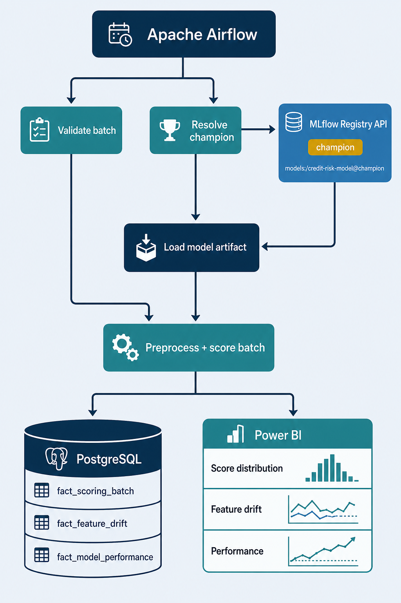
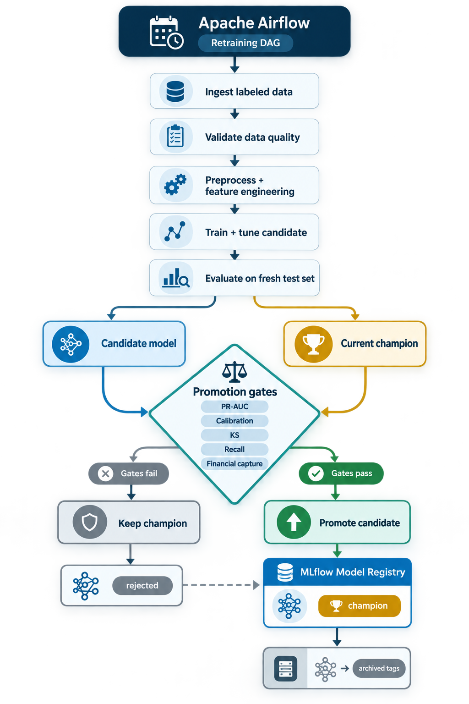

# Batch Inference, Monitoring and Retraining

The repository implements the core operating architecture described here:
Airflow DAGs, PostgreSQL monitoring migrations, and reusable inference,
retraining, promotion, and monitoring modules. The Power BI semantic model and
dashboard remain an external consumption layer and are not committed as a
`.pbix` artifact.

## Batch inference and monitoring



```text
Incoming batch
    -> schema and data-quality validation
    -> resolve models:/credit-risk-model@champion through MLflow
    -> reuse the registered preprocessing and feature contract
    -> score applications
    -> persist predictions and monitoring aggregates in PostgreSQL
    -> expose curated PostgreSQL views for Power BI
```

Airflow schedules and observes this workflow, while reusable code in
`src/pipeline/inference/` performs loading, preprocessing, and scoring. DAG
files should orchestrate tasks only; they should not contain feature
engineering or model logic.

Each batch should record the model version, model alias at scoring time,
timestamp, batch identifier, selected input features, predicted probability,
decision threshold, and binary decision. This creates an auditable link from
each prediction to the exact registered model version.

### Monitoring metrics

| Monitoring area | Examples | Purpose |
| --- | --- | --- |
| Data quality | batch volume, duplicate records, missing required columns, type/range violations, missingness rate | Detect broken or incomplete source deliveries. |
| Feature drift | Population Stability Index (PSI), missingness-rate change, numeric quantile shifts, unseen categorical values | Detect whether model inputs differ from the training reference population. |
| Prediction drift | score-distribution PSI, mean predicted default probability, approval/alert rate, threshold crossing rate | Detect changes in model output before labels arrive. |
| Performance and calibration | PR-AUC, ROC-AUC, KS, precision, recall, F1, Brier score, calibration curve, captured financial exposure | Confirm predictive value once observed defaults are available. |
| Business segmentation | metrics by credit-value band, contract type, portfolio segment, and time period | Identify where the model captures or misses financial risk. |

PSI limits are operational starting points, not universal rules: below 0.10 is
commonly treated as stable, 0.10 to 0.25 as a signal to investigate, and above
0.25 as material drift. Final thresholds should reflect portfolio volatility
and business tolerance.

### PostgreSQL model for Power BI

Power BI should consume curated monitoring tables rather than raw source files.
A star schema is preferable to a single wide table.

```text
dim_calendar ───────────────┐
dim_model ──────────────────┼── fact_scoring_batch
dim_segment (optional) ─────┘

dim_calendar ───────────────┐
dim_model ──────────────────┼── fact_feature_drift
dim_feature ────────────────┘

dim_calendar ───────────────┐
dim_model ──────────────────┼── fact_model_performance
dim_segment (optional) ─────┘
```

| Table | Grain and recommended content |
| --- | --- |
| `dim_model` | One row per registered model version: surrogate key, model name, MLflow version, run ID, model URI, threshold, training window, registration time, and lifecycle status. |
| `dim_calendar` | One row per date, with day, week, month, quarter, and year attributes for Power BI time intelligence. |
| `dim_feature` | One row per monitored feature: name, type, source, selected-feature flag, expected range/category policy, and training-reference metadata. |
| `dim_segment` *(optional)* | Portfolio grouping such as contract type, credit-value band, channel, or business region. |
| `fact_scoring_batch` | One row per scored application: batch ID, scoring timestamp, model key, anonymized application key, probability, threshold, binary prediction, and later the observed target when available. |
| `fact_feature_drift` | One row per batch, model, feature, and segment: PSI, missingness rate, reference/current quantiles or category share, unseen-category rate, alert status, and calculation timestamp. |
| `fact_model_performance` | One row per evaluation period, model, and segment: labeled population size, event rate, PR-AUC, ROC-AUC, KS, precision, recall, F1, Brier score, and captured financial value. |

If record-level traceability is required, keep the 67 selected inputs and
prediction in a restricted audit or staging table. The star schema should hold
prediction measures and feature-level aggregates so dashboards remain fast,
safe, and easy to model.

## Retraining and promotion



Retraining can be scheduled or triggered by material drift, performance
degradation after labels arrive, or a portfolio/business change.

```text
Ingest new labeled data
    -> validate schema, quality, and data window
    -> preprocess and engineer features
    -> train and tune candidate on training/validation data
    -> evaluate candidate and current champion on the same fresh out-of-time test set
    -> log comparison, artifacts, and validation gates to MLflow
    -> register candidate model version
    -> promote or retain champion
```

Promotion criteria must be declared before execution. PR-AUC can remain the
primary metric, protected by guardrails such as calibration, KS, minimum
recall, financial capture, and no material fairness or data-quality failure.
The test set is used only once after candidate decisions are frozen; each
retraining cycle needs a newly defined, time-appropriate holdout set.

If the candidate passes every gate and improves on the current champion, the
DAG moves the `champion` alias to the candidate version. The previous version
is preserved in the registry and receives tags such as
`lifecycle_status=archived`, `archived_at`, and `superseded_by_version`.
If the candidate does not pass, its version remains registered for
traceability, marked as rejected, and the `champion` alias does not move.
